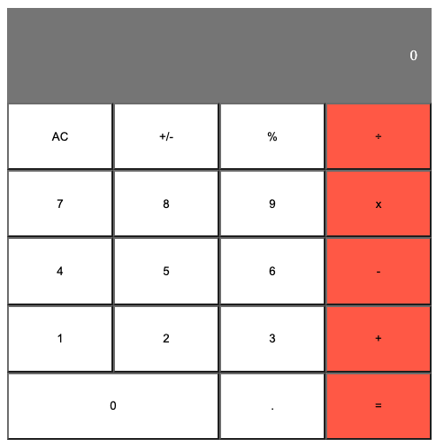

# Describtion

Simple Calculator built with React. It allows users to make simple calculations and read a random math-releted quote.

## Calculator Preview

## Installation

- Clone the repository , use  `https://github.com/SamanAtashi/My-Math-Magicians-app.git` 
- change Directory, use `cd My-Math-Magicians-app`
- `npm install`

## Usage

### Development server
- to run the Webapp you need to use `npm run start`

You can now view the development server at `localhost:3030`.

## Built With

- React.js

## Author

👤 **Saman Atashi**

- Twitter: [@AtashiSaman](https://twitter.com/AtashiSaman)
- GitHub: [@SamanAtashi](https://github.com/SamanAtashi)
- LinkedIn: [LinkedIn](https://www.linkedin.com/in/saman-atashi-9539911b0)

## 🤝 Contributing

Contributions, issues, and feature requests are welcome!

Feel free to check the [issues page](https://github.com/SamanAtashi/My-Math-Magicians-app/issues).

## Show your support

Give a ⭐️ if you like this project!
